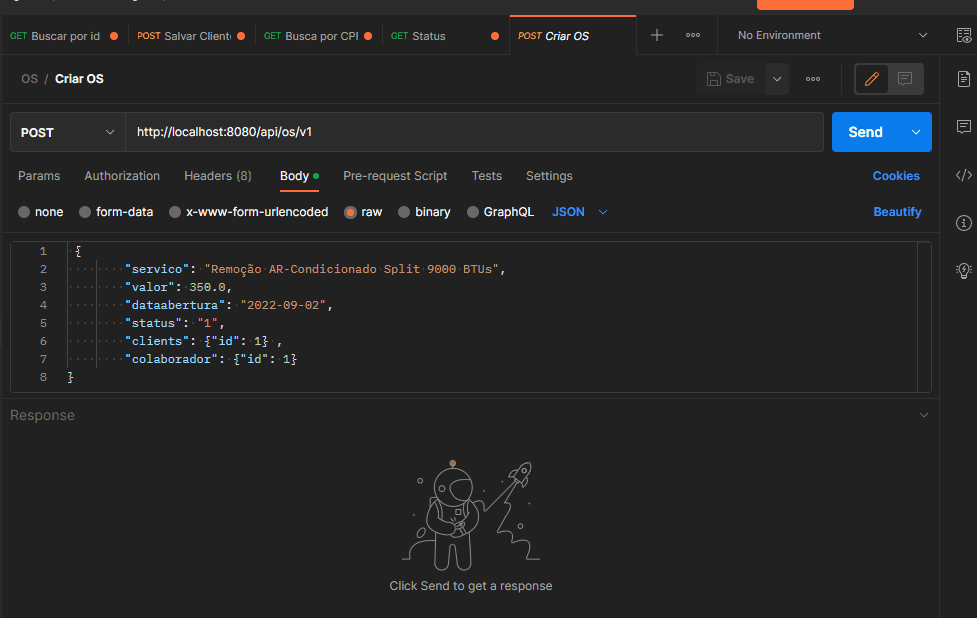
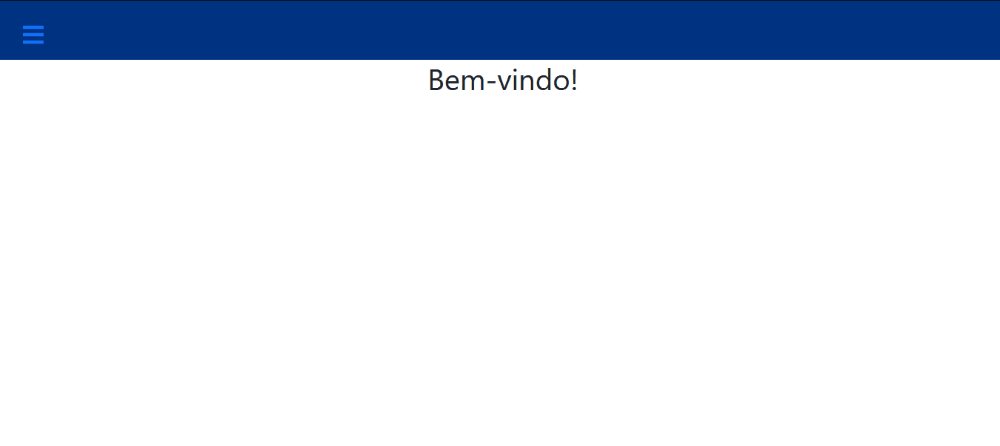

# Back-end - Sistema de Gestão RBHVAC 

O Projeto tem por objetivo elaborar um sistema de gestão para empresa de Refrigeração

Este projeto é composto por duas partes(Back-end e Front-end).  

## Back-end

Projeto em desenvolvimento utilizando:

- Java e Spring Boot

## Features implementadas

- ApiRest responsável pela implementação do CRUD de cadastros de clientes e de colaboradores
- Cadastro de Ordem de Serviço com relacionamento de tabelas com Clientes e Colaboradores
- Utilização de padrão MVC com VO/DTO.
- Banco de dados MySQL 

## Front-end

Projeto em desenvolvimento utilizando:

- Ambiente desenvolvido em React Js, utilizando componentização, Hooks, React Router
- Axios para a realização de requisições ao servidor 
- Html, Css, Javascript, Bootstrap
- Yup para validação de formulário

## Features implementadas

- CRUD responsável pela criação e edição de clientes ecolaboradores conectado ao Bando de Dados
- Função adicionar Ordem de Serviço e alteração de status para concluído
- Sidebar de navegação

Acesso ao repositório [Front-end](https://github.com/RamonBatalha/rbhvacfront) 

## Instruções para teste

- Realizar o clone do Back-end e Front-end e rodar em cojunto
- o Projeto está configurado para rodar no localhost em conjunto com BD MySQL
- Adicionar configurações do Banco de Dados no application.yml de acordo com a sua máquina 

